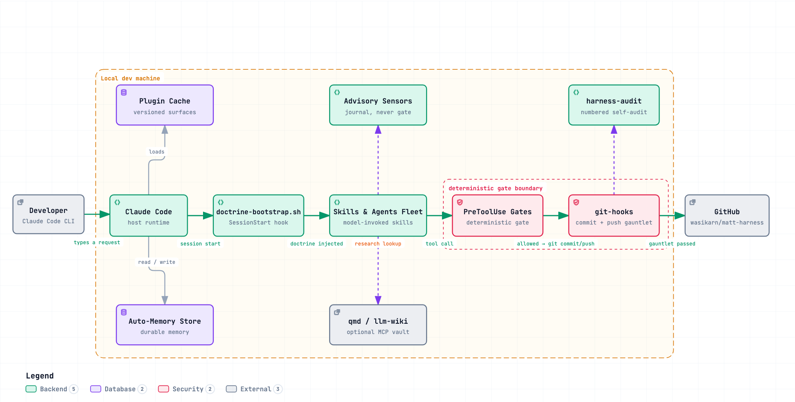
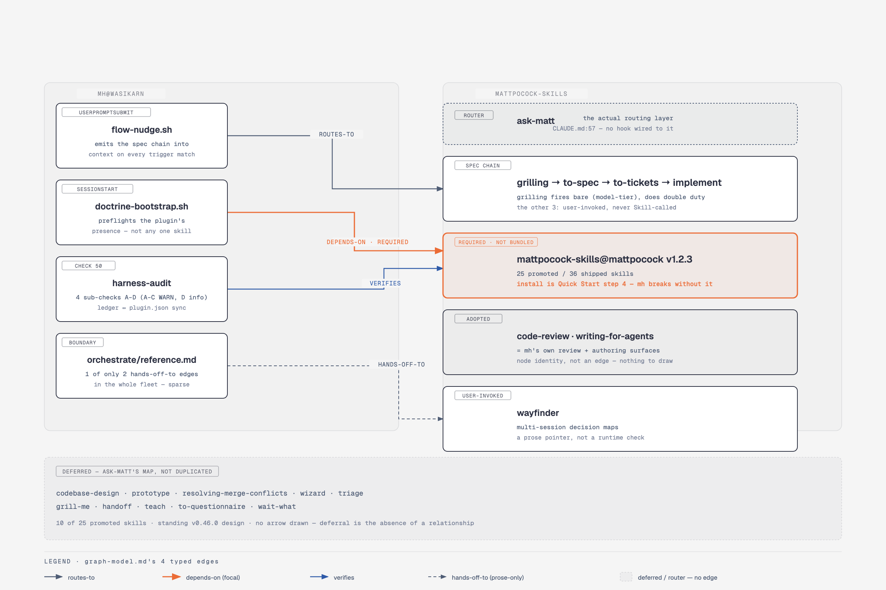

# matt-harness: a Claude Code harness

[](CHANGELOG.md)
[](LICENSE)
[](https://github.com/wasikarn/matt-harness/actions/workflows/validate.yml)

A personal [Claude Code](https://docs.anthropic.com/en/docs/claude-code) harness, packaged
as one installable plugin (`mh@wasikarn`). You get specialist agents, workflow skills,
deny-gates and advisory sensors, an output style, and a terminal theme. There is no symlink
farm and no manual wiring: Claude Code loads everything from the plugin cache. Matt
Pocock's skills install alongside it as their own plugin (`mattpocock-skills@mattpocock`,
see [Quick start](#quick-start)).

The guiding rule is compose, don't create: take the best upstream tools
([mattpocock/skills](https://github.com/mattpocock/skills),
[ECC](https://github.com/affaan-m/everything-claude-code)), bundle them into one plugin,
and only write new surfaces where the backend stack really needs them.

> **Unofficial project.** matt-harness is an independent, community-built harness. It wraps
> [Matt Pocock's `mattpocock-skills` plugin](https://github.com/mattpocock/skills) as its
> primary skill source (Quick start step 4), but it is not an official Matt Pocock project,
> and Matt Pocock does not endorse this repo. Full upstream credit list:
> [Attribution](#attribution).

---

## Table of contents

- [Why it's built this way](#why-its-built-this-way)
- [Quick start](#quick-start)
- [What you get](#what-you-get)
- [How it runs](#how-it-runs)
- [Spotlight](#spotlight)
- [Documentation](#documentation)
- [Attribution](#attribution)
- [License](#license)
- [Architecture](#architecture)
- [Engineering doctrine](#engineering-doctrine)
- [Repository layout](#repository-layout)
- [Development](#development)

---

## Why it's built this way

One structural rule holds the harness together: a strict split between what may block an
action and what may only advise on it.

- Gates (`hooks/gates/`) are deterministic shell checks. They can deny an action.
- Advisory sensors (`hooks/advisory/`) are LLM-backed. They write to a journal. They never
  deny.

Why so strict? An LLM grading work the same model class just produced is circular. No model
here ever gates its own output. Veto power belongs to scripts alone, because a script can't
talk itself into anything. Every loop in the harness ends at a score a deterministic check can
branch on, not a feeling.

Three named disciplines shaped the design: harness engineering, loop engineering, and graph
engineering. Each was researched from primary sources before anything was adopted.
[Engineering doctrine](#engineering-doctrine) spells out which parts are structural, which are
only vocabulary, and which gaps stay open.

---

## Quick start

These steps install `mh@wasikarn` so you can **use** it in your own Claude Code
projects. They don't touch or require a clone of this repo. (Want to work on
matt-harness's own source instead? See [Development](#development).)

**You need:**
- [Claude Code](https://docs.anthropic.com/en/docs/claude-code) installed, v2.1.154+
  (earlier versions auto-enable on install and skip the enable step below)
- A terminal, for the `claude plugin` commands that run outside a session
- `mattpocock-skills`: the one hard dependency, installed as its own plugin right
  alongside mh (both options below cover it, not a separate setup)

Nothing else is required. A few skills reach for tools that aren't bundled and degrade
gracefully without them. Worth having for the full experience, never a blocker:

| Tool | Used by | Get it |
|---|---|---|
| [`gh` CLI](https://cli.github.com/) | `mh:pr`, `mh:ship-merge`, PR/issue-review skills | `brew install gh && gh auth login` |
| `qmd` | Research-flavored skills, per CLAUDE.md's "check qmd before web search" rule | A local MCP semantic-search server over your own markdown; not part of matt-harness, see its own setup |
| [`graphify`](https://github.com/Graphify-Labs/graphify) | Optional codebase knowledge graph: see [Exploring the codebase](#exploring-the-codebase-optional) | `uv tool install graphifyy` |

> Not on this list: `rtk`, a personal shell-alias proxy some contributors run on their
> own machine. It has zero call sites in matt-harness's own code (confirmed via
> `docs/reference/hook-lifecycle-contracts.md`). It's someone's local environment
> detail, not a dependency of this plugin.

Pick one of the two install paths below. Same end state either way; step numbers 1-4
line up across both.

> **Note:** the plugin ships with `defaultEnabled: false`. Step 3 (enable) is required.
>
> **Note:** step 4 is required too. Several of mh's own skills and hooks call
> matt-pocock's skills by namespaced name (`mattpocock-skills:<name>`), so a fresh install
> doesn't work without them. Re-sync later with
> `claude plugin update mattpocock-skills@mattpocock`.
>
> **Scope note:** step 2 installs user-wide by default (neither option below passes
> `--scope`). That means the deny-gates (`hooks/gates/irrecoverable.sh`, which blocks
> `rm -rf`, `git add -A`, `git add .`, `--no-verify`, and hardcoded `/Users/<name>` paths)
> apply to every project you open in Claude Code, not just the one you're evaluating. To
> try it on one project first, run Option B by hand with
> `/plugin install mh@wasikarn --scope project` (or `--scope local`) at step 2.

### Option A: let Claude do it

Paste this into a Claude Code session. It runs the marketplace/install/enable steps
via Bash, then stops at the two checkpoints only a human can clear: a session restart,
and the one setup skill that can't be model-invoked by design.

```text
Install the mh@wasikarn Claude Code plugin end to end, using Bash for every step:

1. claude plugin marketplace add wasikarn/matt-harness
2. claude plugin install mh@wasikarn
3. claude plugin enable mh@wasikarn
4. claude plugin marketplace add mattpocock/skills
5. claude plugin install mattpocock-skills@mattpocock
6. claude plugin list   (show me the result: confirm both plugins show "enabled")

Then stop. Tell me to restart Claude Code, and that once I'm back I need to type
/mattpocock-skills:setup-matt-pocock-skills myself. Don't try to run that skill
for me: it can't be model-invoked.
```

After the restart: run the setup skill yourself, then `/mh:cost-report` as a smoke
test, and `claude plugin list` / `claude plugin details mh@wasikarn` to confirm the install.

### Option B: step by step

```text
# 1. Register the marketplace source (once per machine)
/plugin marketplace add wasikarn/matt-harness

# 2. Install. Default scope is user-wide; read the scope note below
#    if you want to try it on one project first.
/plugin install mh@wasikarn

# 3. Enable, from a terminal.
claude plugin enable mh@wasikarn

# 4. Required: install matt-pocock's skills as their own plugin. mh's
#    hooks and skills route to them by namespaced name; they are not
#    bundled.
/plugin marketplace add mattpocock/skills
/plugin install mattpocock-skills@mattpocock

# 5. Restart Claude Code (the plugin cache loads on startup, so step 4's
#    plugin isn't active in this session yet)

# 6. Run once in each of YOUR projects where you want the harness active
#    (sets up that project's issue tracker, triage labels, doc layout),
#    not matt-harness's own repo. The leading slash is required; this
#    skill can't be model-invoked.
/mattpocock-skills:setup-matt-pocock-skills

# 7. Smoke-test. Plugin skills are namespaced: /mh:<name>, not /<name>.
/mh:cost-report

# 8. Verify the install took (from a terminal, no session needed):
claude plugin list                # both plugins "enabled"
claude plugin details mh@wasikarn   # component inventory + token cost
```

**Uninstall:** `/plugin uninstall mh@wasikarn`  
**Disable but keep installed:** `claude plugin disable mh@wasikarn`

---

## What you get

Fleet size (real current fleet: 38 skills · 12 agents) is patched into this line by
`skills/inventory/scripts/sync-fleet-counts.sh`, so it can't go stale by hand.

| Component | How to invoke |
|---|---|
| Skills | `mh:<skill>`, e.g. `mh:pr`, `mh:orchestrate`. Matt-origin skills live in their own namespace, e.g. `mattpocock-skills:grilling`. |
| Agents | Spawned by Claude, or requested via the `Task` tool, e.g. `mh:code-architect`. |
| Output style | `crisp`, the only live-response register. Concise by default; full decision framing when stakes earn it. |
| Contexts | `dev` · `review` · `research`, loaded by `mh:frame` to set session posture. |
| Theme | `catppuccin-mocha`. |

> Hooks: SessionStart doctrine injection (METHODOLOGY.md), PreToolUse gates in
> `hooks/gates/`, advisory sensors in `hooks/advisory/`, cost tracking in `hooks/stop/`.
> Gates deny the irrecoverable set; sensors journal but never gate.

---

## How it runs

What the plugin does to a session, in the three moments it acts. Click the diagram to open
the interactive HTML version.

[](docs/diagrams/archify/matt-harness-runtime-architecture.html)

**1. Session starts.** `hooks/session/doctrine-bootstrap.sh` injects `docs/METHODOLOGY.md`
(the decision-sizing triad, the reasoning scaffold) into every fresh session. Skills and
agents load from the versioned cache at `~/.claude/plugins/cache/wasikarn/mh/<version>/`,
not the working tree.

**2. The model acts.** Computational deny-gates in `hooks/gates/` stop the irrecoverable set
(`rm -rf`, `git add -A`, `--no-verify`, hardcoded home paths, edits to the verifier code).
Advisory sensors in `hooks/advisory/` journal and nudge but never block. A model grading its
own output is a verdict the model shouldn't get to make. Every box that can stop it is
deterministic shell.

**3. Work ships.** `harness-audit` and the gauntlet run as deterministic verifiers. A
change to a shipped surface reaches the next session while the session that made it keeps
running on the old cached copy. Same-version edits to a cached plugin are silent no-ops,
and that is the most common way work here looks done without being done.

Off the primary path (dashed edges in the diagram): Claude Code reads/writes the
`Auto-Memory Store` directly, and skills can look up `qmd`/`llm-wiki` (optional; surfaces
must degrade gracefully without it).

---

## Spotlight

### Skills

| Skill | When to reach for it |
|---|---|
| `mh:pr` | Create a GitHub PR. Templated body, previewed for confirmation before creation. |
| `mh:ship-merge` | Pre-merge gate. |
| `mh:score-decision` | Weighted numeric verdict for a decision: pass/fail, confidence, trace. |
| `mattpocock-skills:grilling` | Relentless interview to stress-test a plan before building. |
| `mh:orchestrate` | Triage competing tasks and route each to inline / parallel / sequential / drop. |
| `mh:security-auditor` | OWASP Top 10, secrets scanning, threat model plus remediation. |
| `mh:production-audit` | Production readiness check from local evidence. No external service required. |
| `mh:harness-audit` | Deterministic fleet/schema/structural audit of this plugin. |

### Agents

Agents run in a delegated sub-task context. Claude spawns them on its own, or you can
request one via the `Task` tool.

| Agent | Role |
|---|---|
| `mh:code-architect` | System design, module boundaries, and dependency decisions. |
| `mh:backend-architect` | API contracts, service boundaries, data ownership, caching, reliability. The systems-design layer above the framework-narrow `*-patterns` skills. |
| `mh:security-reviewer` | OWASP Top 10, secrets detection, auth flows, and injection risks. |
| `mh:blind-spot-hunter` | Post-review adversarial hunter for cross-file, framework-behavior, and data-flow blind spots normal review misses. |
| `mh:plan-reviewer` | Adversarial review of an implementation plan before code exists. |
| `mh:performance-optimizer` | Bottleneck analysis, profiling strategy, and optimization trade-offs. |
| `mh:silent-failure-hunter` | Finds errors swallowed by catch-all handlers or missing error returns. |
| `mh:requirement-analyst` | Requirement analysis of a ticket/spec/PRD: ambiguities, missing acceptance criteria, edge cases, readiness verdict. |
| `mh:typescript-reviewer` · `mh:nextjs-reviewer` | Language- and framework-specific review: type safety, idioms, async correctness, Next.js App Router rendering and caching. |
| `mh:summarizer` | Condenses long content into filler-free output for any audience. |
| `mh:ideate-critic` | Fresh-context critic for `mh:ideate` Phase 2. Scores, clusters, and deepens divergent ideas. |

### Backend stack patterns

Stack-specific pattern skills, harness-native.

| Skill | When to reach for it |
|---|---|
| `mh:drizzle-patterns` | Drizzle ORM schema, migrations, relations, and query patterns for PostgreSQL / SQLite. |
| `mh:grpc-node-patterns` | gRPC client/server with `@grpc/grpc-js`, TypeScript codegen, streaming, and error codes. |
| `mh:mysql-patterns` | MySQL / MariaDB schema, indexing, transactions, replication, and pool patterns. |

---

## Documentation

| File | What's in it |
|---|---|
| [`BOUNDARY.md`](BOUNDARY.md) | Generated index of every agent, skill, and hook, grouped by bucket |
| [`docs/onboarding.md`](docs/onboarding.md) | 10-minute cold-start guide |
| [`docs/reference/operating-model.md`](docs/reference/operating-model.md) | Canonical source for the gates-deny / sensors-advise doctrine |
| [`docs/reference/reasoning-models.md`](docs/reference/reasoning-models.md) | 39 named mental models (cc-thinking-skills), pointing upstream for full write-ups |
| [`docs/reference/env-vars.md`](docs/reference/env-vars.md) | Operator-tunable environment variables |
| [`docs/reference/graph-model.md`](docs/reference/graph-model.md) | The orchestration graph: nodes, typed edges, anchors (see [Engineering doctrine](#engineering-doctrine)) |
| [`docs/reference/surface-buckets.md`](docs/reference/surface-buckets.md) | Skill vs. agent bucket-naming rules for adding/removing a surface |
| [`docs/reference/third-party-vetting.md`](docs/reference/third-party-vetting.md) | How to vet a new third-party plugin/skill before relying on it |
| [`docs/reference/plugin-cache-mechanics.md`](docs/reference/plugin-cache-mechanics.md) | Dev-machine directory registration vs. a GitHub fetch |
| [`docs/research/harness-engineering-2026-04.md`](docs/research/harness-engineering-2026-04.md) | Primary-source grounding for the gates/advisory split |
| [`docs/harness-decay-cadence.md`](docs/harness-decay-cadence.md) | The harness-engineering 2×2 applied to sensor staleness and decay |
| [`CLAUDE.md`](CLAUDE.md) | Architecture and non-obvious gotchas for Claude Code instances |
| [`CHANGELOG.md`](CHANGELOG.md) | Release notes |

---

## Attribution

matt-harness aggregates components from these upstream projects under their respective
licenses.

> These counts are a hand-tallied snapshot from 2026-07-18. There is no `origin:`
> frontmatter on surface files to regenerate the table from. The kbg-native row is the
> exception: it is machine-synced to the live fleet count.

| Source | License | Adopted |
|---|---|---|
| [mattpocock/skills](https://github.com/mattpocock/skills) | MIT | Installed as the `mattpocock-skills` plugin (not vendored; see Quick start), 0 modified |
| [affaan-m/everything-claude-code](https://github.com/affaan-m/everything-claude-code) | MIT | 85 skills · 48 agents · 64 commands · 3 contexts |
| [TJBoudreaux/cc-thinking-skills](https://github.com/TJBoudreaux/cc-thinking-skills) | MIT | 39 mental models cataloged by name in `docs/reference/reasoning-models.md`, pointing to the upstream repo for full write-ups (no local vendored copy since ticket 94) |
| [ayghri/i-have-adhd](https://github.com/ayghri/i-have-adhd) | MIT | 3 voice rules folded into `output-styles/crisp.md` (v0.68.126, then named `staff-eng.md`) |
| [JuliusBrussee/caveman](https://github.com/JuliusBrussee/caveman) | MIT | Tokenizer-fact justification in `output-styles/crisp.md`, plus a terminal-token status-code convention in `docs/agent-authoring-conventions.md`'s Closed-vocabulary status codes section (v0.68.127); `compress-docs`' safety pattern (verify-before-overwrite, frontmatter handling, sensitive-file refusal) adapted from `caveman-compress` (v0.68.128); symlink guard on `hooks/stop/cost-tracker.sh`'s `costs.jsonl` append, adapted from `caveman-config.js`'s `safeWriteFlag` hardening (v0.68.129) |
| [DietrichGebert/ponytail](https://github.com/DietrichGebert/ponytail) | MIT | YAGNI ladder, the `ponytail:` shortcut-marker convention, and the root-cause-fix rule, revived into `contexts/dev.md` |
| [thedotmack/claude-mem](https://github.com/thedotmack/claude-mem) | Apache-2.0 | `docs/merge-rubric.md`'s real-fix-vs-failure-tolerance rubric, adapted into a Fix-Authenticity Lens in `agents/code-reviewer.md` (v0.68.130; both retired 2026-08-24, #82, with the review pipeline; `mattpocock-skills:code-review` is now the review surface) |
| kbg-native | MIT | 38 skills · 12 agents |

## License

MIT. See [`LICENSE`](LICENSE).

---

*Everything below this line is for people extending or auditing the plugin's own internals.
Skip it if you're just installing and using matt-harness.*

## Architecture

"Compose, don't create" is the reason this repo exists, and only four mechanisms carry the real
weight of it: a hook that emits a chain into every session, a preflight that checks the companion
plugin is even installed, a mechanical audit that keeps a ledger honest, and one sparse prose
boundary. Everything else (the ~25 places mh's surfaces merely *name* a matt skill in passing)
is routing pointers, not wired relationships.
Click the diagram to open the interactive HTML version.

[](docs/diagrams/mh-composition.html)

- **`routes-to`**: `hooks/advisory/flow-nudge.sh` emits the spec chain (`grilling` → `/to-spec` → `/to-tickets` → `/implement`) into session context on `UserPromptSubmit`. `grilling` fires bare (`model`-tier); the other three carry the leading slash and are user-invoked only.
- **`depends-on`**, the required one: Quick start step 4 installs `mattpocock-skills@mattpocock` as a separate plugin; mh's own surfaces are unresolvable without it. `hooks/session/doctrine-bootstrap.sh` preflights the plugin's presence at every `SessionStart` and warns if it's missing or disabled.
- **`verifies`**: harness-audit check 50 (4 sub-checks A-D; A-C are WARN, D is INFO) keeps `docs/reference/mattpocock-integration-map.md`'s 25-row ledger in sync with the installed plugin's own `plugin.json`.
- **`hands-off-to`**: `skills/workflow/orchestrate/reference.md`'s boundary with `mattpocock-skills:wayfinder` (user-typed: `/mattpocock-skills:wayfinder`), one of only two such prose boundaries in the whole fleet.
- **`ask-matt` is the actual routing layer** (`CLAUDE.md`'s "Finding a surface" section). Even though no hook wires to it, it owns the routing map for 10 skills mh deliberately doesn't duplicate.
- **Two matt skills are drawn as adopted, not routed**: `code-review` and `writing-for-agents` *are* mh's own review and authoring surfaces now (the native kbg equivalents were retired), which is a node label, not a relationship to draw an arrow for.

See [How it runs](#how-it-runs) for the session-to-push runtime path, a different diagram from
this one. `docs/reference/mattpocock-integration-map.md` and `docs/reference/graph-model.md` (the
four typed edges this diagram reuses) hold the full ledger and edge definitions.

---

## Engineering doctrine

Three named disciplines shaped the design. Each was researched from primary sources before
anything was adopted, and each landed differently: one is structural, one is vocabulary
with the endpoint rejected, one is naming for structure that already existed.

### Harness engineering: the architectural spine

**Source:** Birgitta Böckeler (Thoughtworks, via Martin Fowler's site,
[April 2026](https://martinfowler.com/articles/harness-engineering.html)). She models a
coding-agent harness as a 2×2 of direction (feedforward / feedback) and execution type
(computational / inferential). Her core warning: an inferential judge (an LLM) grading
work the same model class just produced is circular, and should never be trusted to gate.
"Two optimists agreeing" is this repo's own shorthand for that idea, not a quote from the
article.

**Where it's used:**
- It is the reason `hooks/` splits into `hooks/gates/` (deterministic, can deny) and
  `hooks/advisory/` (LLM-backed, journals only). The computational/inferential split is
  Böckeler's 2×2 applied as the harness's core operating rule (CLAUDE.md, "Why — the
  unifying crux", under its Architecture section).
- `docs/harness-decay-cadence.md` applies the same 2×2 to staleness: when a sensor should
  still be trusted to fire, be retired, or be thickened as models change.
- Grounding: `docs/research/harness-engineering-2026-04.md`, plus two adversarial
  follow-up critiques (`*-critique-cost.md`, `*-critique-gaps.md`) that pressure-tested
  the article before anything was adopted.

**Verdict:** substantially adopted. This is the structural backbone of how hooks are
split, and why an LLM is never wired to `permissionDecision: deny`.

### Loop engineering: vocabulary kept, the autonomous endpoint rejected

**Sources:** Sydney Runkle's ["Art of Loop
Engineering"](https://x.com/sydneyrunkle/article/2066928783534289358) (agent loop /
verification loop / event-driven loop / hill-climbing loop) and
[@0xCodez's 14-step roadmap](https://x.com/0xCodez/article/2066867539305459732)
(harness → loop → self-improving system).

**Where it's used:**
- The harness keeps the L1/L2 vocabulary: bounded loops with a human in them. It rejects
  the endpoint both sources argue toward, an L3/L4 loop that restarts itself with no human
  turn. That is the "no-model-self-start" rule (CLAUDE.md's Operating model), and the
  reason the earlier L2–L5 "bounded-autonomy ratchet" build was retired instead of
  finished.
- In practice: every fix or review loop that remains needs the user to re-invoke it, pass
  by pass. METHODOLOGY Rule 4 ("define done, loop until verified") governs the inside of
  one bounded pass, never a chain of passes that starts itself.
- The full keep/discard analysis of both sources lives in `BOUNDARY.md`, under
  cross-references.

**Verdict:** the loop vocabulary and the L1/L2 patterns carry real weight here. The
unattended L3/L4 conclusion is a deliberate non-goal.

### Graph engineering: naming what already ran

**Source:** eigent.ai's ["Graph Engineering for AI
Agents"](https://www.eigent.ai/blog/graph-engineering-ai-agents), traced back to its
academic root (GraphBit, [arXiv:2605.13848](https://arxiv.org/abs/2605.13848)) and prior
art (LangGraph, AutoGen, CrewAI). The tracing mattered: the blog post's 4-way failure
taxonomy turned out to repackage well-studied problems (specification gaming, goal
misgeneralization, MAS coordination conflict) under new labels.

**Where it's used:**
- `docs/reference/graph-model.md` writes down the existing dispatch/verification structure
  as an explicit graph: node types (Skill, Agent, Gate, Advisory sensor) and 4 typed edges
  (`routes-to`, `depends-on`, `verifies`, `hands-off-to`). It adds no new mechanism. It
  collects structure that was already running, scattered across
  `skills/workflow/orchestrate/SKILL.md` and `BOUNDARY.md`, into one place.
- Only one edge type is mechanically enforced the way GraphBit enforces typed edges:
  `verifies`, which is what the gates in `hooks/gates/` already do. The rest (which route
  an orchestrator picks, whether an upstream artifact was copied into the next spawn
  prompt, whether a skill's stated handoff is honored) are prompt discipline, and the doc
  says so plainly instead of implying they're checked.
- No external anchor exists yet: no held-out eval set the harness didn't author, no real
  usage metric. `graph-model.md` records that as an open question.

**Verdict:** vocabulary borrowed to document existing structure clearly. The structure
predates the term.

---

## Repository layout

```text
matt-harness/
├── .claude-plugin/       # plugin.json + marketplace.json (both bumped on every release)
├── agents/               # specialist subagents (.md each)
├── skills/               # SKILL.md per directory, grouped by bucket:
│                         #   meta/ review/ workflow/ patterns/ agent-support/ design/
├── hooks/                # gates/ (deny) · advisory/ (journal) · session/ (inject) · stop/ (cost)
├── output-styles/        # crisp, the only live-response register
├── contexts/             # dev / review / research session frames
├── themes/               # catppuccin-mocha.json
├── scripts/              # validation helpers (run-gauntlet.sh runs the full parallel gauntlet)
├── docs/                 # onboarding, METHODOLOGY, reference/, research/, adr/
├── git-hooks/            # pre-commit (lint + JSON + LOC gate) · pre-push (gauntlet)
├── BOUNDARY.md           # generated index of every surface; read this first
├── CLAUDE.md             # project instructions for Claude Code instances
└── CHANGELOG.md          # release notes
```

---

## Development

### Validation

```bash
# Primary validation gate
claude plugin validate . --strict

# Full gauntlet: plugin-validate + shell-lint + JSON lint + harness-audit
# + the behavioral test suite. CLAUDE.md's Validation section holds the
# authoritative file list; no count stated here, counts drift.
bash scripts/run-gauntlet.sh
```

### Git hooks

Hooks live in `git-hooks/`, not `.git/hooks/`. Wire once per clone:

```bash
git config core.hooksPath git-hooks
```

| Hook | What it runs |
|---|---|
| `pre-commit` | `bash -n` + shellcheck, JSON validation, harness-audit, new-file LOC gate |
| `pre-push` | Full gauntlet |

### Adding a component

The authoritative step-by-step (fleet-count sync, `BOUNDARY.md` regen, and the
cache-refresh ordering gotcha) is CLAUDE.md's "Adding or removing a surface". The short
version:

1. Create the file, following the pattern of an existing component in the same directory.
2. Bump `version` in both `.claude-plugin/plugin.json` and
   `.claude-plugin/marketplace.json`. Same-version edits to a cached plugin are silent
   no-ops.
3. `claude plugin validate . --strict`, then
   `bash skills/inventory/scripts/sync-fleet-counts.sh`.
4. `claude plugin update mh@wasikarn`, commit, push, restart Claude Code.

### Exploring the codebase (optional)

[graphify](https://github.com/Graphify-Labs/graphify) is a separate, personally-installed
tool (not bundled with this plugin) that turns a corpus into a queryable knowledge graph.
Run `/graphify .` to build one for this repo; `graphify query "<question>"` /
`graphify path "A" "B"` / `graphify explain "X"` then answer structural questions (who calls
what, what enforces a given doctrine) that complement, rather than replace, this repo's own
`qmd`-based research flow (CLAUDE.md's "graphify" section has the full division of labor).
`graphify-out/` is gitignored: the graph goes stale within hours of any commit, so regenerate
it on demand instead of trusting a checked-in snapshot.
