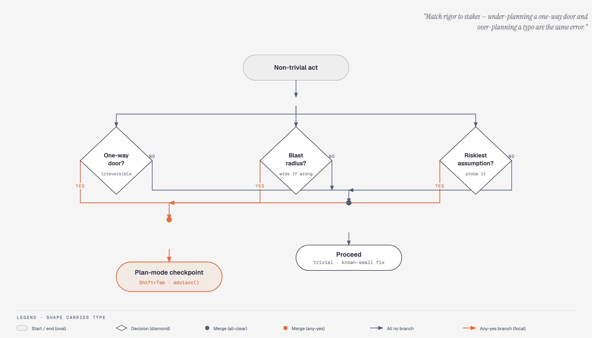

# matt-harness: a Claude Code harness

[](CHANGELOG.md)
[](LICENSE)
[](https://github.com/wasikarn/matt-harness/actions/workflows/validate.yml)

A personal [Claude Code](https://docs.anthropic.com/en/docs/claude-code) harness, packaged
as one installable plugin (`mh@wasikarn`). You get specialist agents, workflow skills,
deny-gates and advisory sensors, an output style, and a terminal theme. There is no symlink
farm and no manual wiring: Claude Code loads everything from the plugin cache. Matt
Pocock's skills install alongside it as their own plugin (`mattpocock-skills@mattpocock`,
see [Quick start](#quick-start)).

The guiding rule is compose, don't create: take the best upstream tools
([mattpocock/skills](https://github.com/mattpocock/skills),
[ECC](https://github.com/affaan-m/everything-claude-code)), bundle them into one plugin,
and only write new surfaces where the backend stack really needs them.

> **Unofficial project.** matt-harness is an independent, community-built harness. It wraps
> [Matt Pocock's `mattpocock-skills` plugin](https://github.com/mattpocock/skills) as its
> primary skill source (Quick start step 4), but it is not an official Matt Pocock project,
> and Matt Pocock does not endorse this repo. Full upstream credit list:
> [Attribution](#attribution).

---

## Table of contents

- [Why it's built this way](#why-its-built-this-way)
- [How it runs](#how-it-runs)
- [Architecture](#architecture)
- [Quick start](#quick-start)
- [What you get](#what-you-get)
- [Engineering doctrine](#engineering-doctrine)
- [Spotlight](#spotlight)
- [Repository layout](#repository-layout)
- [Development](#development)
- [Documentation](#documentation)
- [Attribution](#attribution)
- [License](#license)

---

## Why it's built this way

One structural rule holds the harness together: a strict split between what may block an
action and what may only advise on it.

- Gates (`hooks/gates/`) are deterministic shell checks. They can deny an action.
- Advisory sensors (`hooks/advisory/`) are LLM-backed. They write to a journal. They never
  deny.

Why so strict? An LLM grading work the same model class just produced is circular. No model
here ever gates its own output. Veto power belongs to scripts alone, because a script can't
talk itself into anything. Every loop in the harness ends at a score a deterministic check can
branch on, not a feeling.

Three named disciplines shaped the design — harness engineering, loop engineering, and graph
engineering — and each was researched from primary sources before anything was adopted.
[Engineering doctrine](#engineering-doctrine) spells out which parts are structural, which are
only vocabulary, and which gaps stay open.

---

## How it runs

What the plugin does to a session, in the three moments it acts.

**1. Session starts.** `hooks/session/doctrine-bootstrap.sh` injects `docs/METHODOLOGY.md` —
the decision-sizing triad, the reasoning scaffold — into every fresh session. Skills and
agents load from the versioned cache at `~/.claude/plugins/cache/wasikarn/mh/<version>/`,
not the working tree.

**2. The model acts.** Computational deny-gates in `hooks/gates/` stop the irrecoverable set
(`rm -rf`, `git add -A`, `--no-verify`, hardcoded home paths, edits to the verifier code).
Advisory sensors in `hooks/advisory/` journal and nudge but never block. A model grading its
own output is a verdict the model shouldn't get to make — every box that can stop it is
deterministic shell.

**3. Work ships.** `harness-audit` and the gauntlet run as deterministic verifiers. A
change to a shipped surface reaches the next session while the session that made it keeps
running on the old cached copy. Same-version edits to a cached plugin are silent no-ops,
and that is the most common way work here looks done without being done.

---

## Architecture

One session flows through six lanes — user, model, hooks, agents+skills, scripts, verify — with one irreversible boundary.
Click the diagram to open the interactive HTML version.

[](docs/diagrams/mh-core-workflow.html)

- **User → Model** — natural-language prompt (or slash command) reaches Claude Model, which is itself a tiered pipeline: Fable plans, Sonnet acts, Opus reviews, Haiku judges.
- **Model → Dispatcher** — every skill/agent spawn, output-style emit, and tool response is bound by the PreToolUse dispatcher. One registered hook (`gate:pretooluse-dispatch`) fans out to 11 gate rules in `pretooluse-table.json`; strictest-wins decides one verdict per call.
- **Hooks → Scripts** — SessionStart injects `docs/METHODOLOGY.md`; the dispatcher fans out to hook scripts (`dispatch-*.sh`, `*.py`) which are the same files the gauntlet re-invokes from git. 18 hook registrations across 9 event types.
- **Verify** — `pre-commit` runs the fast gate (syntax, JSON, harness-audit, LOC); `pre-push` runs the full 6-layer gauntlet. `compliance-audit` and `deep-audit` are fresh-context verifiers — manual, not auto-fired.

The orange node is the only place where the maker cannot grade its own work. Everything else journals or runs as advisory.

### Decision-sizing triad — METHODOLOGY Rule 1

Before any non-trivial act, three yes/no questions. **Yes to any one of them routes the act through a plan-mode checkpoint** before editing — not the work itself, the analysis of the work. The match-rigor-to-stakes reflex is the doctrine; the plan-mode entry is the mechanism.

[](docs/diagrams/mh-decision-triad.html)

- **One-way door?** If the act is irreversible (forced push, merged PR, deleted branch, public post) — stop and get explicit approval before proceeding.
- **Blast radius?** If the failure mode touches more than one file, one subsystem, or one other person — narrow the change or checkpoint first.
- **Riskiest assumption?** Name the one thing most likely to invalidate the plan if it turns out to be wrong. Probe it before committing.
- **Default to suggesting plan-mode strongly.** The user keeps control (Shift+Tab or approve the plan); enter it yourself only when the door is clearly one-way or the user signals uncertainty. Skip entirely for trivial / known-small-fix / mechanical changes — under-planning a one-way door and over-planning a typo are the same error.

For genuinely contested calls, `mattpocock-skills:grilling` is the on-demand escalation. `advisor()` is the routine pressure-test before substantive work and before declaring done — measured load-bearing in practice.

### Gauntlet pipeline — pre-push 6-layer verifier

The decision-triad tells you *whether* to plan. The gauntlet tells you *whether the artifact ships*. Pre-commit runs a fast subset; pre-push runs the full pre-push gauntlet through `scripts/run-gauntlet.sh`. All six layers launch in parallel as background processes and merge strictest-wins: any single ❌ sets `fail=1` and the push is blocked. Each layer writes its own log under `work-tmp/` so a failing layer is fully reproducible, not just a single exit code.

[](docs/diagrams/mh-gauntlet-pipeline.html)

- **Six layers run in parallel.** Each is a deterministic verifier — no model-as-gate, no "looks fine" rationalization. One shell process per layer, no shared state.
- **Strictest-wins merge via `wait_layer()`.** Every layer checks its PID's exit code; any non-zero sets the `fail=1` flag that the surrounding runner reads. Layers don't talk to each other — the merge is plain bash over PIDs.
- **One log per layer.** `validate.log`, `lint.log`, `json.log`, `audit.log`, `pathhyg.log`, `hooktests.log`. A failing layer's full output is reproducible from the log alone, no re-run needed.
- **Pre-commit runs the fast gate; pre-push runs the full gauntlet.** Same machinery, smaller scope on commit; everything runs on push. Either hook can block — pre-commit faster, pre-push more thorough.

For the gauntlet's design intent and the merge contract, see [`scripts/run-gauntlet.sh`](scripts/run-gauntlet.sh) and the gauntlet-handoff narrative in `docs/research/`. The pre-commit fast gate is in [`git-hooks/pre-commit`](git-hooks/pre-commit).

### Hook event × tier matrix — when each gate fires

The gauntlet covers the *artifact*. Hooks cover the *session*: every Claude Code event fires zero or more handlers, each carrying a tier. The deny-vs-advise split is computational — a `gate:` prefix is immune to any profile or kill-switch, while `minimal` and `standard` handlers are advisory. The matrix below lists every handler at every event × tier intersection; the coral focal sits on PreToolUse × strict because one entry fans out to 11 underlying deny-gates via `hooks/pretooluse-table.json`.

[](docs/diagrams/mh-hook-tier-matrix.html)

- **9 events × 3 tiers.** Every cell names the handlers at that intersection. Empty cells (`—`) mean no handler exists at that intersection — not a typo, the registry genuinely has no entry there.
- **PreToolUse is single-cell.** The hooks/hooks.json entry is the dispatcher; `hooks/pretooluse-table.json` carries the 11 underlying `gate:*` entries (all strict, all immune to kill-switch). Adding a new deny-gate means appending to the table, not editing `hooks.json`.
- **30 hook entries total** across 9 events: 6 minimal / 9 standard / 15 strict. The strict column dominates because the deny-vs-advise doctrine puts load-bearing checks behind hooks the model can't argue with.
- **Tier is load-bearing.** A handler can move between tiers only by re-registering it. Profile flags and kill-switches affect `standard` handlers; they do not reach `gate:` entries. This is the property that lets "the harness can be turned off for non-critical projects" coexist with "the irreversible paths are still blocked".

See `hooks/hooks.json` and `hooks/pretooluse-table.json` for the registry source-of-truth.

---

## Quick start

Run these commands inside Claude Code:

```text
# 1. Register the marketplace source (once per machine)
/plugin marketplace add wasikarn/matt-harness

# 2. Install. Default scope is user-wide; read the scope note below
#    if you want to try it on one repo first.
/plugin install mh@wasikarn

# 3. Enable, from a terminal. Needs Claude Code v2.1.154+; earlier
#    versions auto-enable on install and can skip this step.
claude plugin enable mh@wasikarn

# 4. Required: install matt-pocock's skills as their own plugin. mh's
#    hooks and skills route to them by namespaced name; they are not
#    bundled.
/plugin marketplace add mattpocock/skills
/plugin install mattpocock-skills@mattpocock

# 5. Run once per repo (issue tracker, triage labels, doc layout). The
#    leading slash is required; this skill can't be model-invoked. If
#    step 4's install summary said "Run /reload-plugins to activate",
#    run that first, or this command won't resolve in the same session.
/mattpocock-skills:setup-matt-pocock-skills

# 6. Restart Claude Code (the plugin cache loads on startup)

# 7. Smoke-test. Plugin skills are namespaced: /mh:<name>, not /<name>.
/mh:cost-report

# 8. Verify the install took (from a terminal, no session needed):
claude plugin list                # both plugins "enabled"
claude plugin details mh@wasikarn   # component inventory + token cost
```

> **Note:** the plugin ships with `defaultEnabled: false`. Step 3 is required.
>
> **Note:** step 4 is required too. Several of mh's own skills and hooks call
> matt-pocock's skills by namespaced name (`mattpocock-skills:<name>`), so a fresh install
> doesn't work without them. Re-sync later with
> `claude plugin update mattpocock-skills@mattpocock`.
>
> **Scope note:** step 2 without a `--scope` flag installs user-wide. That means the
> deny-gates (`hooks/gates/irrecoverable.sh`, which blocks `rm -rf`, `git add -A`,
> `git add .`, `--no-verify`, and hardcoded `/Users/<name>` paths) apply to every project
> you open in Claude Code, not just the one you're evaluating. To try it on one repo
> first: `/plugin install mh@wasikarn --scope project` (or `--scope local`).

**Uninstall:** `/plugin uninstall mh@wasikarn`  
**Disable but keep installed:** `claude plugin disable mh@wasikarn`

---

## What you get

Fleet size (real current fleet: 59 skills · 17 agents) is patched into this line by
`skills/inventory/scripts/sync-fleet-counts.sh`, so it can't go stale by hand.

| Component | How to invoke |
|---|---|
| Skills | `mh:<skill>`, e.g. `mh:pr`, `mh:orchestrate`. Matt-origin skills live in their own namespace, e.g. `mattpocock-skills:grilling`. |
| Agents | Spawned by Claude, or requested via the `Task` tool, e.g. `mh:code-architect`. |
| Output style | `crisp`, the only live-response register. Concise by default; full decision framing when stakes earn it. |
| Contexts | `dev` · `review` · `research`, loaded by `mh:frame` to set session posture. |
| Theme | `catppuccin-mocha`. |

> Hooks: SessionStart doctrine injection (METHODOLOGY.md), PreToolUse gates in
> `hooks/gates/`, advisory sensors in `hooks/advisory/`, cost tracking in `hooks/stop/`.
> Gates deny the irrecoverable set; sensors journal but never gate.

---

## Engineering doctrine

Three named disciplines shaped the design. Each was researched from primary sources before
anything was adopted, and each landed differently: one is structural, one is vocabulary
with the endpoint rejected, one is naming for structure that already existed.

### Harness engineering: the architectural spine

**Source:** Birgitta Böckeler (Thoughtworks, via Martin Fowler's site,
[April 2026](https://martinfowler.com/articles/harness-engineering.html)). She models a
coding-agent harness as a 2×2 of direction (feedforward / feedback) and execution type
(computational / inferential). Her core warning: an inferential judge (an LLM) grading
work the same model class just produced is circular, and should never be trusted to gate.
"Two optimists agreeing" is this repo's own shorthand for that idea, not a quote from the
article.

**Where it's used:**
- It is the reason `hooks/` splits into `hooks/gates/` (deterministic, can deny) and
  `hooks/advisory/` (LLM-backed, journals only). The computational/inferential split is
  Böckeler's 2×2 applied as the harness's core operating rule (CLAUDE.md, "Why — the
  unifying crux", under its Architecture section).
- `docs/harness-decay-cadence.md` applies the same 2×2 to staleness: when a sensor should
  still be trusted to fire, be retired, or be thickened as models change.
- Grounding: `docs/research/harness-engineering-2026-04.md`, plus two adversarial
  follow-up critiques (`*-critique-cost.md`, `*-critique-gaps.md`) that pressure-tested
  the article before anything was adopted.

**Verdict:** substantially adopted. This is the structural backbone of how hooks are
split, and why an LLM is never wired to `permissionDecision: deny`.

### Loop engineering: vocabulary kept, the autonomous endpoint rejected

**Sources:** Sydney Runkle's ["Art of Loop
Engineering"](https://x.com/sydneyrunkle/article/2066928783534289358) (agent loop /
verification loop / event-driven loop / hill-climbing loop) and
[@0xCodez's 14-step roadmap](https://x.com/0xCodez/article/2066867539305459732)
(harness → loop → self-improving system).

**Where it's used:**
- The harness keeps the L1/L2 vocabulary: bounded loops with a human in them. It rejects
  the endpoint both sources argue toward, an L3/L4 loop that restarts itself with no human
  turn. That is the "no-model-self-start" rule (CLAUDE.md's Operating model), and the
  reason the earlier L2–L5 "bounded-autonomy ratchet" build was retired instead of
  finished.
- In practice: every fix or review loop that remains needs the user to re-invoke it, pass
  by pass. METHODOLOGY Rule 4 ("define done, loop until verified") governs the inside of
  one bounded pass, never a chain of passes that starts itself.
- The full keep/discard analysis of both sources lives in `BOUNDARY.md`, under
  cross-references.

**Verdict:** the loop vocabulary and the L1/L2 patterns carry real weight here. The
unattended L3/L4 conclusion is a deliberate non-goal.

### Graph engineering: naming what already ran

**Source:** eigent.ai's ["Graph Engineering for AI
Agents"](https://www.eigent.ai/blog/graph-engineering-ai-agents), traced back to its
academic root (GraphBit, [arXiv:2605.13848](https://arxiv.org/abs/2605.13848)) and prior
art (LangGraph, AutoGen, CrewAI). The tracing mattered: the blog post's 4-way failure
taxonomy turned out to repackage well-studied problems (specification gaming, goal
misgeneralization, MAS coordination conflict) under new labels.

**Where it's used:**
- `docs/reference/graph-model.md` writes down the existing dispatch/verification structure
  as an explicit graph: node types (Skill, Agent, Gate, Advisory sensor) and 4 typed edges
  (`routes-to`, `depends-on`, `verifies`, `hands-off-to`). It adds no new mechanism. It
  collects structure that was already running, scattered across
  `skills/workflow/orchestrate/SKILL.md` and `BOUNDARY.md`, into one place.
- Only one edge type is mechanically enforced the way GraphBit enforces typed edges:
  `verifies`, which is what the gates in `hooks/gates/` already do. The rest (which route
  an orchestrator picks, whether an upstream artifact was copied into the next spawn
  prompt, whether a skill's stated handoff is honored) are prompt discipline, and the doc
  says so plainly instead of implying they're checked.
- No external anchor exists yet: no held-out eval set the harness didn't author, no real
  usage metric. `graph-model.md` records that as an open question.

**Verdict:** vocabulary borrowed to document existing structure clearly. The structure
predates the term.

---

## Spotlight

### Skills

| Skill | When to reach for it |
|---|---|
| `mh:pr` | Create a GitHub PR. Templated body, previewed for confirmation before creation. |
| `mh:security-scan` | AgentShield scan of harness surfaces via the `security-reviewer` agent. |
| `mh:ship-merge` · `mh:ship-release` | Pre-merge gate · end-to-end release ceremony. |
| `mh:score-decision` | Weighted numeric verdict for a decision: pass/fail, confidence, trace. |
| `mattpocock-skills:grilling` | Relentless interview to stress-test a plan before building. |
| `mh:orchestrate` | Triage competing tasks and route each to inline / parallel / sequential / drop. |
| `mh:agent-architecture-audit` | 12-layer diagnostic for wrapper regression, memory pollution, repair loops. |
| `mh:context-budget` | Token usage audit. Finds bloat and produces prioritized savings. |
| `mh:security-auditor` | OWASP Top 10, secrets scanning, threat model plus remediation. |
| `mh:production-audit` | Production readiness check from local evidence. No external service required. |
| `mh:harness-audit` | Deterministic fleet/schema/structural audit of this plugin. |

### Agents

Agents run in a delegated sub-task context. Claude spawns them on its own, or you can
request one via the `Task` tool.

| Agent | Role |
|---|---|
| `mh:code-architect` | System design, module boundaries, and dependency decisions. |
| `mh:backend-architect` | API contracts, service boundaries, data ownership, caching, reliability. The systems-design layer above the framework-narrow `*-patterns` skills. |
| `mh:security-reviewer` | OWASP Top 10, secrets detection, auth flows, and injection risks. |
| `mh:blind-spot-hunter` | Post-review adversarial hunter for cross-file, framework-behavior, and data-flow blind spots normal review misses. |
| `mh:plan-reviewer` | Adversarial review of an implementation plan before code exists. |
| `mh:performance-optimizer` | Bottleneck analysis, profiling strategy, and optimization trade-offs. |
| `mh:refactor-cleaner` | Dead code removal, simplification, and naming cleanup. |
| `mh:silent-failure-hunter` | Finds errors swallowed by catch-all handlers or missing error returns. |
| `mh:spec-miner` | Extracts implicit requirements from code when no spec doc exists. |
| `mh:requirement-analyst` | Requirement analysis of a ticket/spec/PRD: ambiguities, missing acceptance criteria, edge cases, readiness verdict. |
| `mh:typescript-reviewer` · `mh:python-reviewer` · `mh:nextjs-reviewer` | Language- and framework-specific review: type safety, idioms, async correctness, Next.js App Router rendering and caching. |
| `mh:build-error-resolver` | Fixes build and type errors with minimal diffs. |
| `mh:summarizer` | Condenses long content into filler-free output for any audience. |
| `mh:ideate-critic` | Fresh-context critic for `mh:ideate` Phase 2. Scores, clusters, and deepens divergent ideas. |

### Backend stack patterns

Stack-specific pattern skills, harness-native.

| Skill | When to reach for it |
|---|---|
| `mh:drizzle-patterns` | Drizzle ORM schema, migrations, relations, and query patterns for PostgreSQL / SQLite. |
| `mh:grpc-node-patterns` | gRPC client/server with `@grpc/grpc-js`, TypeScript codegen, streaming, and error codes. |
| `mh:mysql-patterns` | MySQL / MariaDB schema, indexing, transactions, replication, and pool patterns. |

---

## Repository layout

```text
matt-harness/
├── .claude-plugin/       # plugin.json + marketplace.json (both bumped on every release)
├── agents/               # specialist subagents (.md each)
├── skills/               # SKILL.md per directory, grouped by bucket:
│                         #   meta/ review/ workflow/ patterns/ agent-support/ design/
├── hooks/                # gates/ (deny) · advisory/ (journal) · session/ (inject) · stop/ (cost)
├── output-styles/        # crisp, the only live-response register
├── contexts/             # dev / review / research session frames
├── themes/               # catppuccin-mocha.json
├── scripts/              # validation helpers (run-gauntlet.sh runs the full parallel gauntlet)
├── docs/                 # onboarding, METHODOLOGY, reference/, research/, adr/
├── git-hooks/            # pre-commit (lint + JSON + LOC gate) · pre-push (gauntlet)
├── BOUNDARY.md           # generated index of every surface; read this first
├── CLAUDE.md             # project instructions for Claude Code instances
└── CHANGELOG.md          # release notes
```

---

## Development

### Validation

```bash
# Primary validation gate
claude plugin validate . --strict

# Full gauntlet: plugin-validate + shell-lint + JSON lint + harness-audit
# + the behavioral test suite. CLAUDE.md's Validation section holds the
# authoritative file list; no count stated here, counts drift.
bash scripts/run-gauntlet.sh
```

### Git hooks

Hooks live in `git-hooks/`, not `.git/hooks/`. Wire once per clone:

```bash
git config core.hooksPath git-hooks
```

| Hook | What it runs |
|---|---|
| `pre-commit` | `bash -n` + shellcheck, JSON validation, harness-audit, new-file LOC gate |
| `pre-push` | Full gauntlet |

### Adding a component

The authoritative step-by-step (fleet-count sync, `BOUNDARY.md` regen, and the
cache-refresh ordering gotcha) is CLAUDE.md's "Adding or removing a surface". The short
version:

1. Create the file, following the pattern of an existing component in the same directory.
2. Bump `version` in both `.claude-plugin/plugin.json` and
   `.claude-plugin/marketplace.json`. Same-version edits to a cached plugin are silent
   no-ops.
3. `claude plugin validate . --strict`, then
   `bash skills/inventory/scripts/sync-fleet-counts.sh`.
4. `claude plugin update mh@wasikarn`, commit, push, restart Claude Code.

---

## Documentation

| File | What's in it |
|---|---|
| [`BOUNDARY.md`](BOUNDARY.md) | Generated index of every agent, skill, and hook, grouped by bucket |
| [`docs/onboarding.md`](docs/onboarding.md) | 10-minute cold-start guide |
| [`docs/reference/operating-model.md`](docs/reference/operating-model.md) | The gates-deny / sensors-advise doctrine as a self-contained excerpt |
| [`docs/reference/reasoning-models.md`](docs/reference/reasoning-models.md) | 39 named mental models (cc-thinking-skills), pointing upstream for full write-ups |
| [`docs/reference/env-vars.md`](docs/reference/env-vars.md) | Operator-tunable environment variables |
| [`docs/reference/graph-model.md`](docs/reference/graph-model.md) | The orchestration graph: nodes, typed edges, anchors (see [Engineering doctrine](#engineering-doctrine)) |
| [`docs/research/harness-engineering-2026-04.md`](docs/research/harness-engineering-2026-04.md) | Primary-source grounding for the gates/advisory split |
| [`docs/harness-decay-cadence.md`](docs/harness-decay-cadence.md) | The harness-engineering 2×2 applied to sensor staleness and decay |
| [`CLAUDE.md`](CLAUDE.md) | Architecture and non-obvious gotchas for Claude Code instances |
| [`CHANGELOG.md`](CHANGELOG.md) | Release notes |

---

## Attribution

matt-harness aggregates components from these upstream projects under their respective
licenses.

> These counts are a hand-tallied snapshot from 2026-07-18. There is no `origin:`
> frontmatter on surface files to regenerate the table from. The kbg-native row is the
> exception: it is machine-synced to the live fleet count.

| Source | License | Adopted |
|---|---|---|
| [mattpocock/skills](https://github.com/mattpocock/skills) | MIT | Installed as the `mattpocock-skills` plugin (not vendored; see Quick start), 0 modified |
| [affaan-m/everything-claude-code](https://github.com/affaan-m/everything-claude-code) | MIT | 85 skills · 48 agents · 64 commands · 3 contexts |
| [TJBoudreaux/cc-thinking-skills](https://github.com/TJBoudreaux/cc-thinking-skills) | MIT | 39 mental models cataloged by name in `docs/reference/reasoning-models.md`, pointing to the upstream repo for full write-ups (no local vendored copy since ticket 94) |
| [ayghri/i-have-adhd](https://github.com/ayghri/i-have-adhd) | MIT | 3 voice rules folded into `output-styles/crisp.md` (v0.68.126, then named `staff-eng.md`) |
| [JuliusBrussee/caveman](https://github.com/JuliusBrussee/caveman) | MIT | Tokenizer-fact justification in `output-styles/crisp.md`, plus a terminal-token status-code convention in `docs/agent-authoring-conventions.md`'s Closed-vocabulary status codes section (v0.68.127); `compress-docs`' safety pattern (verify-before-overwrite, frontmatter handling, sensitive-file refusal) adapted from `caveman-compress` (v0.68.128); symlink guard on `hooks/stop/cost-tracker.sh`'s `costs.jsonl` append, adapted from `caveman-config.js`'s `safeWriteFlag` hardening (v0.68.129) |
| [DietrichGebert/ponytail](https://github.com/DietrichGebert/ponytail) | MIT | YAGNI ladder, the `ponytail:` shortcut-marker convention, and the root-cause-fix rule, revived into `contexts/dev.md` |
| [thedotmack/claude-mem](https://github.com/thedotmack/claude-mem) | Apache-2.0 | `docs/merge-rubric.md`'s real-fix-vs-failure-tolerance rubric, adapted into a Fix-Authenticity Lens in `agents/code-reviewer.md` (v0.68.130; both retired 2026-08-24, #82, with the review pipeline; `mattpocock-skills:code-review` is now the review surface) |
| kbg-native | MIT | 59 skills · 17 agents |

---

## License

MIT. See [`LICENSE`](LICENSE).
